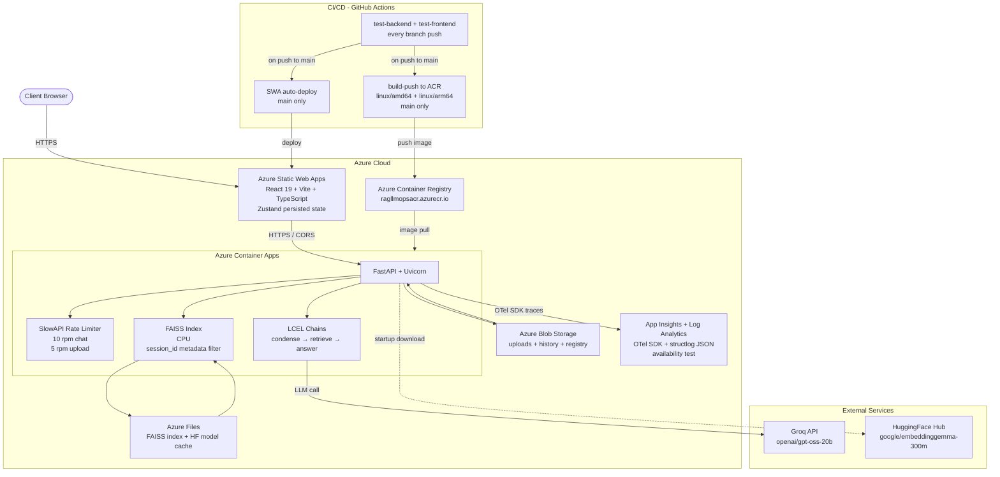

# RAG LLMOps

A production-grade Retrieval-Augmented Generation system built with FastAPI, React, and Azure — demonstrating end-to-end LLMOps practices: document ingestion, multi-turn conversational retrieval, cloud-native deployment, observability, and security hardening.

[](https://github.com/renswickd/rag-llmops/actions/workflows/ci.yaml)
[](https://github.com/renswickd/rag-llmops/actions/workflows/azure-static-web-apps-black-forest-00e252400.yml)

---

## Live Deployment

| Component | URL |
|:---|:---|
| Frontend (Azure Static Web Apps) | https://black-forest-00e252400.7.azurestaticapps.net |
| Backend API (Azure Container Apps) | https://rag-llmops-backend.mangowave-3ff37a09.australiaeast.azurecontainerapps.io/api/v1/health |
| Interactive API docs (local dev) | http://localhost:8000/docs |

---

## System Architecture


---

## Key Architectural Decisions

### 1. Storage abstraction via Python Protocol

The `StorageBackend` in `core/storage.py` is a structural Protocol (PEP 544) — not an abstract base class. Any object that satisfies the interface is accepted without explicit inheritance. The factory `create_storage_backend()` resolves to `LocalStorageBackend` (local dev) or `AzureBlobStorageBackend` (production) based on the `APP_ENVIRONMENT` env var, not the config file. This lets the same container image run locally and in ACA without code changes.

```
StorageBackend (Protocol)
├── LocalStorageBackend    — filesystem paths under data/
└── AzureBlobStorageBackend — Azure Blob containers: uploads/, history/, registry/
```

The Azure implementation uses a read-modify-write pattern for `append_history()` because Azure Block Blobs do not support byte-range appends. This is documented inline as a conscious trade-off, acceptable at demo scale (< 100 messages per session).

### 2. Singleton dependency injection

All heavyweight objects (embedding model, LLM, FAISS index, chat manager) are initialised exactly once during FastAPI's lifespan startup event in `api/dependencies.py`. Routers receive them via `Depends()` — never by direct instantiation. This matters because loading a HuggingFace embedding model takes several seconds; per-request construction would make the API unusable.

Startup order is intentional:
```
ModelLoader → FaissManager → Retriever → ChatManager → SessionRegistry
```
Each service depends on the one before it, and the order is documented in `dependencies.py`.

### 3. Per-session FAISS isolation via metadata filtering

A single global FAISS index serves all sessions. Per-session isolation is enforced by tagging every chunk with its `session_id` at ingestion time. At query time, the retriever passes `filter_dict = {"session_id": session_id}` — FAISS filters the candidate pool before scoring. Sessions are fully isolated without the operational cost of per-session indexes.

Full session delete requires an index rebuild (`rebuild_without_session()`) because FAISS does not support in-place deletion. The rebuild iterates all remaining sessions' documents and reconstructs the index, which is saved to disk immediately.

### 4. Two-stage LangChain LCEL retrieval chain

The chat pipeline uses two sequential LCEL chains in `conversation/chat_manager.py`:

```
User follow-up question + last N turns
    └─► condense_chain  (Groq LLM)
          "Rephrase as a standalone query"
    └─► answer_chain
          Retrieve top-k chunks (similarity / MMR / score-threshold)
          └─► Groq LLM → grounded answer + source citations
```

The condense step is critical for multi-turn accuracy: without it, "What did it say about that?" cannot be matched against FAISS vectors. History uses a sliding window (`max_history_turns`, default 10) to bound context length and cost.

### 5. Session created at upload, not at first chat

The `session_id` is assigned the moment a document is uploaded (`upload_YYYYMMDD_HHMMSS_<8hex>`). The session registry entry is written immediately, so `GET /chat/sessions` always reflects all uploaded documents — even before the user sends a single message. This avoids a class of bugs where sessions appear only after the first chat interaction.

### 6. Observability with OpenTelemetry

The `azure-monitor-opentelemetry` SDK is conditionally imported — only when `APPLICATIONINSIGHTS_CONNECTION_STRING` is present. This means local development has zero observability overhead and no Azure dependency. In production (ACA), the SDK auto-instruments FastAPI request traces, dependency calls, and exceptions, exporting to Application Insights. Structured JSON logs use `structlog` throughout — never the stdlib `logging` module — ensuring every log line is a parseable JSON object.

An availability test polls `/api/v1/health` every 5 minutes from 3 geographic probe locations. An alert rule fires when 2 of 3 locations fail, balancing sensitivity with false-positive suppression.

### 7. Rate limiting at the router layer

SlowAPI (a Starlette-native port of Flask-Limiter) applies per-endpoint rate limits backed by an in-memory store:

- `POST /documents/upload` — 5 requests/minute
- `POST /chat` — 10 requests/minute

Limits are enforced at the router layer, not middleware, so individual endpoints can carry different thresholds. The in-memory store is appropriate for a single-instance deployment; a Redis backend would be needed for horizontal scaling.

### 8. Multi-stage Docker build

The `Dockerfile` uses two stages: a Node stage that builds the React frontend into `frontend/dist/`, then a Python stage that copies only the compiled assets and installs backend dependencies via `uv sync --no-group dev`. The production image has no Node runtime, no pytest, and no Streamlit — the dev dependency group is excluded at build time via `uv`'s dependency groups feature.

---

## Tech Stack

### Backend

| Component | Technology |
|:---|:---|
| API framework | FastAPI + Uvicorn |
| LLM | Groq (`openai/gpt-oss-20b`) via LangChain LCEL |
| Embeddings | HuggingFace `google/embeddinggemma-300m` |
| Vector store | FAISS (CPU) — persisted to Azure Files in production |
| Storage abstraction | Python Protocol: `LocalStorageBackend` / `AzureBlobStorageBackend` |
| Document parsing | PyMuPDF, PyPDF |
| Chunking | LangChain `RecursiveCharacterTextSplitter` |
| Rate limiting | SlowAPI (Starlette-native) |
| Observability | azure-monitor-opentelemetry + structlog (structured JSON) |
| Config | YAML + python-dotenv |
| Dependency management | uv + `uv.lock` (CPU-only Torch pinned for Linux) |

### Frontend

| Component | Technology |
|:---|:---|
| UI library | React 19 + Vite + TypeScript (strict mode) |
| Styling | TailwindCSS 4 (CSS-first config) + shadcn/ui |
| Components | Radix UI primitives |
| State | Zustand with `persist` middleware (storage key `rag-app-storage-v2`) |
| Markdown rendering | react-markdown + remark-gfm |
| File upload | react-dropzone |

### Infrastructure

| Resource | Technology |
|:---|:---|
| Container registry | Azure Container Registry (`ragllmopsacr.azurecr.io`, Standard tier) |
| Backend hosting | Azure Container Apps — Consumption plan, scale-to-zero |
| Session data | Azure Blob Storage (containers: `uploads`, `history`, `registry`) |
| FAISS + model cache | Azure Files share mounted at `/app/faiss_index` |
| Observability | Log Analytics workspace + Application Insights |
| Frontend hosting | Azure Static Web Apps (auto-deploys on push to `main`) |
| CI/CD | GitHub Actions — pytest, frontend build, multi-platform ACR push |

---

## API Reference

All endpoints are prefixed `/api/v1/`.

| Method | Endpoint | Rate limit | Description |
|:---:|:---|:---:|:---|
| `GET` | `/health` | — | Returns app name, version, environment |
| `POST` | `/documents/upload` | 5 rpm | Upload a `.pdf`, `.txt`, or `.md` file (max 10 MB); returns `session_id`, `file_name`, `chunks_created` |
| `POST` | `/chat` | 10 rpm | Send a question with `session_id` (`max_length=5000`); returns answer, sources, conversation metadata |
| `GET` | `/chat/sessions` | — | List all sessions with metadata (`session_id`, `created_at`, `documents[]`) |
| `DELETE` | `/chat/sessions/{session_id}` | — | Full teardown: registry + files + FAISS rebuild + in-memory history |
| `GET` | `/chat/sessions/{session_id}/history` | — | Return stored conversation turns for frontend re-hydration |

### Session lifecycle

```
POST /documents/upload
  → creates session_id (upload_YYYYMMDD_HHMMSS_<8hex>)
  → archives file to storage backend
  → chunks + embeds → FAISS index (chunks tagged with session_id)
  → writes registry entry

POST /chat  { session_id, question }
  → condense question with history
  → retrieve top-k chunks filtered by session_id
  → generate grounded answer
  → append turn to storage backend

DELETE /chat/sessions/{session_id}
  → remove registry entry
  → delete stored files
  → rebuild FAISS index from remaining sessions
  → clear in-memory history
```

---

## Getting Started

### Prerequisites

- Python 3.13 + [uv](https://docs.astral.sh/uv/getting-started/installation/)
- Node.js 20+ and npm
- A [Groq API key](https://console.groq.com/)
- A [HuggingFace token](https://huggingface.co/settings/tokens)
- Docker (for containerised run)

### Install

```bash
git clone https://github.com/renswickd/rag-llmops.git
cd rag-llmops

uv sync           # creates .venv, installs all deps from uv.lock
cd frontend && npm install && cd ..
```

### Configure

```bash
cp .env.example .env
# Fill in GROQ_API_KEY and HF_TOKEN
```

`.env.example`:
```
GROQ_API_KEY=<your-groq-api-key>
HF_TOKEN=<your-hf-token>
CONFIG_PATH=config/config.yaml
CORS_ORIGINS=http://localhost:5173
SERVE_FRONTEND=false
APP_ENVIRONMENT=dev
```

### Run — development (two terminals)

```bash
# Terminal 1
python run.py
# API:  http://localhost:8000
# Docs: http://localhost:8000/docs

# Terminal 2
cd frontend && npm run dev
# UI: http://localhost:5173 (proxies /api → :8000)
```

### Run — Docker (single container, frontend + API together)

```bash
docker build -t rag-llmops:local .
docker run --rm -p 8000:8000 --env-file .env \
  -e SERVE_FRONTEND=true rag-llmops:local
# http://localhost:8000
```

On Apple Silicon add `--platform linux/amd64` when using a locally built image.

### Run — docker-compose (persistent volumes)

```bash
docker compose up --build   # first run
docker compose up           # subsequent runs
docker compose down         # stop, keep volumes
docker compose down -v      # stop and delete all volumes
```

### Test

```bash
uv run pytest tests/ -v                              # full backend suite
uv run pytest tests/test_chat.py -v                  # single module
uv run pytest tests/test_chat.py::test_chat_endpoint -v  # single test

cd frontend && npm run build   # tsc strict type-check + bundle
cd frontend && npm run lint    # ESLint
```

---

## Configuration

All tunable parameters live in `config/config.yaml`. Environment variables take precedence over config values for secrets and deployment-specific settings.

| Section | Key | Default | Description |
|:---|:---|:---:|:---|
| `llm.groq` | `model_name` | `openai/gpt-oss-20b` | Groq-hosted model |
| `llm.groq` | `max_history_turns` | `10` | Sliding window for conversation context |
| `embedding_model` | `model_name` | `google/embeddinggemma-300m` | HuggingFace embedding model |
| `storage` | `backend` | `local` | `local` or `azure_blob` (overridden by `APP_ENVIRONMENT=production`) |
| `data_ingestion` | `chunk_size` | `1000` | Characters per chunk |
| `data_ingestion` | `chunk_overlap` | `150` | Overlap between adjacent chunks |
| `retriever` | `default_search_type` | `similarity` | `similarity`, `mmr`, or `similarity_score_threshold` |
| `retriever` | `default_top_k` | `4` | Chunks retrieved per query |
| `rate_limiting` | `chat_rpm` | `10` | Requests/minute on `POST /chat` |
| `rate_limiting` | `upload_rpm` | `5` | Requests/minute on `POST /documents/upload` |

---

## Project Structure

```
.
├── api/
│   ├── main.py              # FastAPI app, CORS, rate limiting, optional frontend serving
│   ├── dependencies.py      # Singleton init (ModelLoader → FaissManager → Retriever → ChatManager)
│   ├── limiter.py           # SlowAPI limiter instance
│   ├── routers/
│   │   ├── chat.py          # POST /chat, GET+DELETE /sessions, GET /sessions/{id}/history
│   │   ├── documents.py     # POST /documents/upload
│   │   └── health.py
│   └── schemas/
│       ├── chat.py          # ChatRequest (max_length=5000), ChatResponse, SessionMetadata
│       └── document.py      # UploadResponse
├── conversation/
│   ├── chat_manager.py      # LCEL condense + answer chains, sliding history window
│   └── prompt_builder.py    # RAG and condense prompt templates
├── ingestion/
│   ├── data_ingestion.py    # Parse → chunk → tag with session_id
│   ├── faiss_manager.py     # FAISS lifecycle: create, load, add, rebuild
│   └── retriever.py         # similarity / MMR / threshold search with session_id filter
├── core/
│   ├── storage.py           # StorageBackend Protocol + Local and AzureBlob implementations
│   ├── session_store.py     # SessionRegistry — storage-backed session metadata
│   ├── config.py            # YAML config loader
│   ├── logging_config.py    # structlog setup (LOG_FILE_ENABLED env var)
│   └── exceptions.py        # RagAssistantException (captures file, line, traceback)
├── utils/
│   ├── model_loader.py      # Groq LLM + HuggingFace embeddings (loaded once at startup)
│   └── file_handling.py     # Session ID generation
├── config/
│   └── config.yaml
├── frontend/
│   ├── public/
│   │   └── staticwebapp.config.json  # SWA routing + security headers
│   ├── src/
│   │   ├── api/client.ts             # Typed fetch wrapper for all backend endpoints
│   │   ├── store/appStore.ts         # Zustand store with persist middleware
│   │   ├── types/index.ts            # TypeScript interfaces mirroring Pydantic schemas
│   │   └── components/              # Layout, Header, Sidebar, ChatArea, DocumentUpload, etc.
│   ├── vite.config.ts               # TailwindCSS plugin, @/ alias, /api proxy to :8000
│   └── package.json
├── .github/
│   └── workflows/
│       ├── ci.yaml                                          # test-backend, test-frontend, build-push
│       └── azure-static-web-apps-black-forest-00e252400.yml # SWA auto-deploy
├── tests/                   # pytest — storage backends, session store, ingestion, retrieval, API
├── Dockerfile               # Multi-stage: Node (frontend build) → Python (FastAPI + dist/)
├── docker-compose.yaml      # Named volumes: data, faiss, hf-cache, logs
├── run.py                   # Entrypoint (uvicorn.run via Python API)
├── pyproject.toml           # uv deps + CPU-only Torch source + dev group separation
└── uv.lock
```

---

## Design Constraints and Trade-offs

| Constraint | Rationale |
|:---|:---|
| Single global FAISS index | Simpler operations; per-session isolation via metadata filter is sufficient at this scale |
| CPU-only Torch | Azure Container Apps Consumption plan has no GPU; embedding model is small enough to run on CPU within acceptable latency |
| `uv sync --no-group dev` in Docker | Keeps the production image lean — pytest and Streamlit are absent from the final layer |
| Read-modify-write for Blob history | Azure Block Blobs have no byte-range append API; acceptable at < 100 messages/session |
| In-memory SlowAPI store | Stateless single-instance deployment; Redis would be required for horizontal scaling |
| Vite build-time env injection | `VITE_API_URL` must be injected in the GitHub Actions `env:` block — Azure Static Web Apps portal settings are not forwarded to GitHub runners |
| TypeScript strict mode | `noUnusedLocals`, `noUnusedParameters`, `noFallthroughCasesInSwitch` all enabled; `tsc -b` runs before bundling in CI |

---

## Future Enhancements

### Retrieval quality
- **Hybrid search** — combine BM25 sparse retrieval with FAISS dense retrieval (Reciprocal Rank Fusion) to improve recall on keyword-heavy queries
- **Re-ranking** — add a cross-encoder re-ranker (e.g., `cross-encoder/ms-marco-MiniLM-L-6-v2`) as a post-retrieval step to improve precision before the answer chain
- **Streaming responses** — switch the answer chain to SSE (`StreamingResponse`) so the frontend renders tokens as they arrive
- **Multi-document sessions** — allow uploading multiple files into a single session and let the retriever cite which document each chunk came from

### Infrastructure and scalability
- **Redis-backed rate limiting** — replace the in-memory SlowAPI store with Redis so rate limits are enforced correctly across multiple ACA replicas
- **Automated backend CD** — add a `deploy` job to CI that calls `az containerapp update --image` after `build-push`, making every push to `main` a full continuous deployment
- **Per-session FAISS shards** — for high-volume multi-tenant use, partition the FAISS index by session to enable O(1) session deletes without a full rebuild
- **Managed Identity auth** — replace the Blob Storage connection string with Azure Managed Identity (`DefaultAzureCredential`) to eliminate long-lived credentials from ACA secrets

### Observability
- **Custom KQL dashboards** — build Log Analytics workbooks to visualise query latency by session, retrieval hit rate, and LLM token consumption over time
- **LLM cost tracking** — emit token counts as custom metrics to Application Insights and alert when daily token spend exceeds a threshold
- **Distributed tracing** — propagate OpenTelemetry trace context into LangChain LCEL chains using the LangChain OpenTelemetry integration so end-to-end traces span ingestion, retrieval, and generation

### Security
- **Document type allowlist enforcement** — validate MIME type server-side (not just extension) before parsing
- **Content moderation** — add a pre-generation guardrail to detect and reject prompt injection attempts in uploaded documents
- **Per-user session scoping** — integrate Azure AD B2C or a lightweight JWT layer so sessions are bound to authenticated users rather than being publicly accessible by session ID
